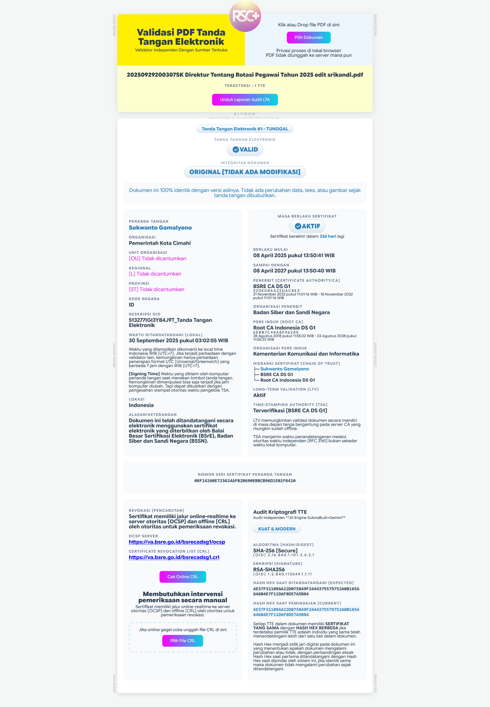

# Validator Tanda Tangan Elektronik (TTE) PDF

Validator ini dirancang untuk memverifikasi dokumen PDF yang memiliki tanda tangan elektronik, dengan fokus utama pada kompatibilitas standar **BSrE (Balai Sertifikasi Elektronik)**.

## 📌 Fitur
Validator TTE ini memungkinkan validasi sertifikat digital pada dokumen PDF secara independen dan mandiri:

* **Kompatibilitas BSrE:** Dioptimalkan untuk verifikasi TTE yang dirilis oleh BSrE. (Belum teruji secara menyeluruh untuk vendor lain).
* **Deteksi Jumlah TTE:** Mendeteksi jumlah TTE yang ditanam dalam PDF dengan menampilkan hash hex setiap TTE.
* **Versi Online & Offline:** Tersedia versi yang dapat ditanamkan (*embedded*) di website maupun versi offline untuk penggunaan lokal tanpa internet.
* **Mandiri (Self-contained):** Seluruh dependensi library JavaScript telah di-*bundling* ke dalam satu file lokal agar tidak bergantung pada koneksi CDN eksternal.

---

## 📸 Screenshot

> *Tampilan antarmuka aplikasi validator TTE.*

---

## 🛠️ File Utama
1.  **[vtte.html](vtte.html)** - versi dependensi library online.
2.  **[vtte-offline.html](vtte-offline.html)** - versi lokal offline.
3.  **[vtte-verify.html](vtte-verify.html)** - simulasi Audit LTA.

---

## 🤝 Kontribusi & Kontak
* [gmailme](mailto:sukmasibudi@gmail.com)

---

## 📄 Lisensi
Didistribusikan untuk penggunaan umum.
